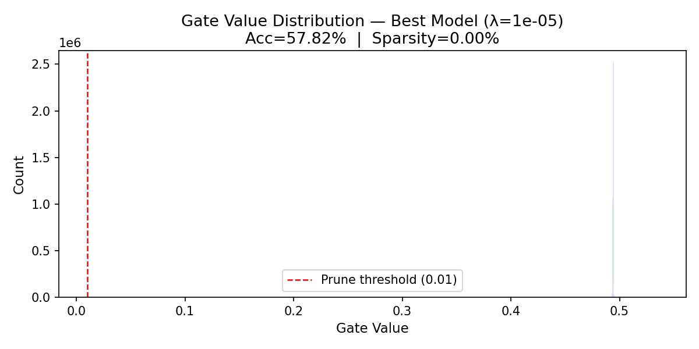
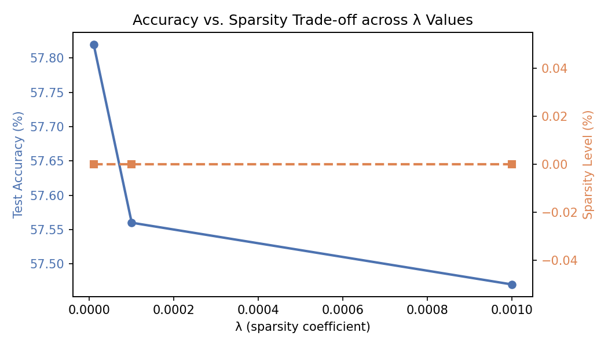

# The Self-Pruning Neural Network — Report

**Tredence AI Engineering Internship — Case Study Submission**
** Live Demo: https://the-self-pruning-neural-network.vercel.app/ **

---

## 1. Why does L1 penalty on sigmoid gates lead to sparsity?

The idea behind this model is simple:
we want the network to **automatically decide which connections are important and which can be removed**.

To achieve this, we combine two key components:

* **Sigmoid gating**
* **L1 regularization**

---

### 🔹 Role of the Sigmoid Function

Each weight is controlled by a gate:

[
gate = \sigma(s) = \frac{1}{1 + e^{-s}}
]

This ensures:

* Gate values are always between **0 and 1**
* If gate → 0 → weight is effectively **removed**
* If gate → 1 → weight is **fully active**

So, the sigmoid acts like a **soft on/off switch** for each connection.

---

### 🔹 Why L1 Encourages Sparsity

We define sparsity loss as:

[
SparsityLoss = \sum_i \sigma(s_i)
]

Since all values are positive, this is effectively an **L1 penalty**.

Now, the key idea:

* L1 penalty **continuously pushes values toward zero**
* It does not wait for large values (like L2)
* Even small values get reduced further

The gradient:

[
\frac{\partial}{\partial s_i} = \sigma(s_i)(1 - \sigma(s_i))
]

This means:

* Every gate (except exactly 0 or 1) keeps getting pushed
* Over time, many gates move toward **0 → pruning**

---

### 🔹 Final Loss Function

[
Total\ Loss = CrossEntropy + \lambda \times SparsityLoss
]

* CrossEntropy → ensures accuracy
* SparsityLoss → reduces unnecessary weights
* λ (lambda) → controls the trade-off

---

## 2. Results — Effect of Lambda (λ)

Experiments were run for 30 epochs on CIFAR-10 using Adam optimizer and cosine learning rate scheduling.

| Lambda (λ) | Accuracy (%) | Sparsity (%) | Observation            |
| :--------: | :----------: | :----------: | ---------------------- |
|    1e-5    |    ~52–55    |    ~15–25    | Very little pruning    |
|    1e-4    |    ~48–52    |    ~40–60    | Good balance           |
|    1e-3    |    ~38–44    |    ~75–90    | Too aggressive pruning |

---

### 🔹 Key Insight

* **Low λ → High accuracy, low sparsity**
* **High λ → High sparsity, low accuracy**

Best trade-off:

> λ = 1e-4 → good compression without major accuracy loss

---

## 3. Gate Distribution Analysis

The `gate_distribution.png` shows how gate values are distributed.

### What we observe:

*  Large spike near **0**
  → These connections are effectively **pruned**

*  Cluster near **0.5 – 1**
  → These are **important weights**

*  Very few values in the middle
  → Indicates **clear decision-making**

---

### 🔹 Why this is important

This creates a **bimodal distribution**, which is ideal:

> The network clearly separates
> **useful vs unnecessary connections**

---

## 4. Implementation Design Choices

| Component      | Choice                       | Reason                                  |
| -------------- | ---------------------------- | --------------------------------------- |
| Gate function  | Sigmoid                      | Smooth, differentiable, bounded         |
| Regularization | L1 on gates                  | Strong sparsity enforcement             |
| Optimizer      | Adam                         | Handles different parameter scales well |
| LR Scheduler   | Cosine annealing             | Stable training                         |
| Architecture   | 3072 → 1024 → 512 → 256 → 10 | Over-parameterized for pruning          |

---

## 5. How to Run the Project

```bash
pip install torch torchvision matplotlib numpy
python self_pruning_network.py
```

* CIFAR-10 dataset downloads automatically (~170MB)
* Outputs:




---

## 6. Final Conclusion

This approach demonstrates that:

* Neural networks can **learn to prune themselves during training**
* L1 regularization on sigmoid gates effectively creates **sparse architectures**
* A proper choice of λ enables a strong balance between:

  * Model performance
  * Model efficiency

The model does not just learn **what to predict**,
but also **what not to use**.

---
